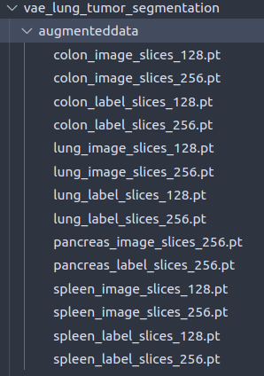

# VAE lung tumor segmentation

## Changelog

**Nick**:
> Changed `prep_data()` to be able to take a desired resolution. \
> For the rest of the code to work, please rename your datasets on the form:
>
>   organ`_`type`_slices_`resolution`.pt`
>
> as shown in this picture:
> \
> 

**Nick**:
> Changed preprocessed-data-directory name from `augmenteddata` to `prep_data`. Also changed in notebook.

**Nick**:
> Organized notebook. Added working checkpointing, i.e automatic VAE-model-saving.
